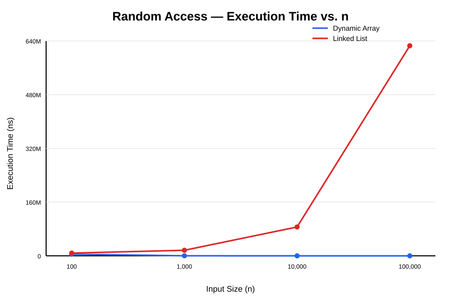
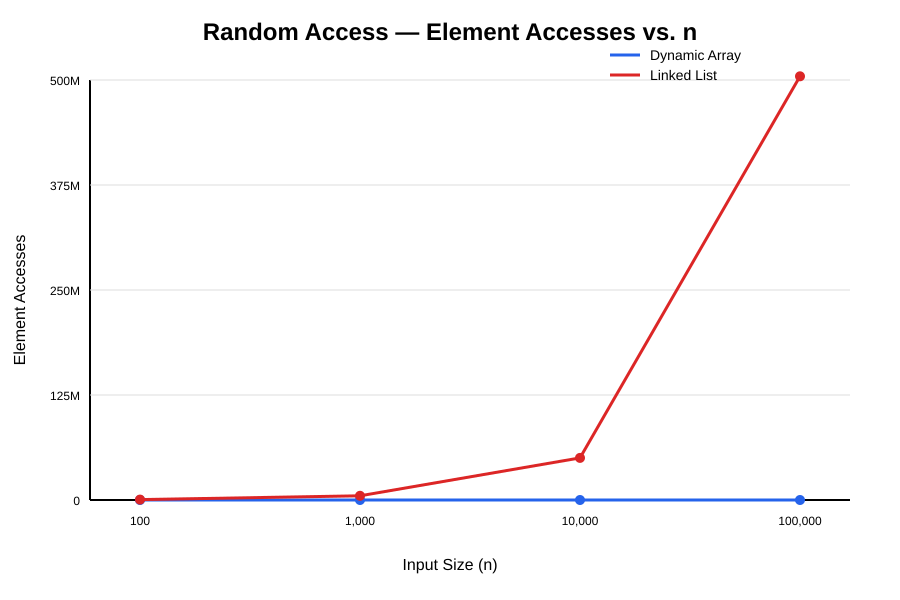

# Assignment 2 — Algorithmic Analysis, Correctness and Performance Trade-offs

## 1. Overview

This project implements and analyzes three fundamental data structures in Java: a Dynamic Array, a Linked List, and a Min-Heap.

The purpose of the assignment is to study the correctness and performance of these data structures using both theoretical and experimental analysis. The project compares different operations using asymptotic notation, loop invariants, and benchmark experiments.

The implemented data structures support the following operations:

- **Dynamic Array:** `add(x)`, `add(index, x)`, `remove(index)`, `get(index)`, `contains(x)`
- **Linked List:** `add(x)`, `add(index, x)`, `remove(index)`, `get(index)`, `contains(x)`
- **Min-Heap:** `insert(x)`, `peekMin()`, `extractMin()`

The implementations are tested with empty structures, single and multiple elements, duplicate values, boundary cases, invalid indices where applicable, and large inputs.

## 2. Complexity Analysis

### Dynamic Array

| Operation | Best Case | Average Case | Worst Case | Auxiliary Space |
|---|---|---|---|---|
| `add(x)` | Ω(1) | Θ(1) amortized | O(n) | O(n) during resize |
| `add(index, x)` | Ω(1) | Θ(n) | O(n) | O(n) during resize |
| `remove(index)` | Ω(1) | Θ(n) | O(n) | O(1) |
| `get(index)` | Θ(1) | Θ(1) | Θ(1) | O(1) |
| `contains(x)` | Ω(1) | Θ(n) | O(n) | O(1) |

`add(x)` normally places the new element directly at the end of the array. When the internal array is full, a larger array must be created and the existing elements must be copied. Therefore, a single insertion may take O(n), while repeated end insertions have Θ(1) amortized time.

`add(index, x)` may require shifting elements to the right. Insertion at the end requires no shifting, while insertion near the beginning may move almost all elements.

`remove(index)` shifts all elements after the removed position one place to the left. Removing the last element requires no shifting, while removing near the beginning requires Θ(n) movements.

`get(index)` uses direct array indexing, so its running time does not depend on the number of stored elements.

`contains(x)` checks elements sequentially. The value may be found immediately in the best case, while the average and worst cases require examining a number of elements proportional to n.

### Linked List

| Operation | Best Case | Average Case | Worst Case | Auxiliary Space |
|---|---|---|---|---|
| `add(x)` | Ω(1) | Θ(n) | O(n) | O(1) |
| `add(index, x)` | Ω(1) | Θ(n) | O(n) | O(1) |
| `remove(index)` | Ω(1) | Θ(n) | O(n) | O(1) |
| `get(index)` | Ω(1) | Θ(n) | O(n) | O(1) |
| `contains(x)` | Ω(1) | Θ(n) | O(n) | O(1) |

In this implementation, `add(x)` traverses the list from the head to the last node before attaching the new node. Therefore, adding to an empty list is constant time, while adding to a non-empty list may require traversing up to n nodes.

`add(index, x)` inserts directly at the head when the index is 0. For other positions, the list must be traversed until the node before the requested index is reached.

`remove(index)` removes the head directly when the index is 0. Removing from another position requires traversal to the previous node.

`get(index)` starts at the head and follows references until it reaches the requested position. Unlike a Dynamic Array, a Linked List does not provide direct random access.

`contains(x)` searches sequentially through the nodes until the value is found or the end of the list is reached.

### Min-Heap

| Operation | Best Case | Average Case | Worst Case | Auxiliary Space |
|---|---|---|---|---|
| `insert(x)` | Ω(1) | Θ(log n) | O(log n) | O(n) during resize |
| `peekMin()` | Θ(1) | Θ(1) | Θ(1) | O(1) |
| `extractMin()` | Ω(1) | Θ(log n) | O(log n) | O(1) |

`insert(x)` first places the new value at the end of the heap. It then moves the value upward while it is smaller than its parent. If the heap property is already satisfied, no swaps are required. In the worst case, the element moves from the bottom of the heap to the root.

`peekMin()` directly returns the root of the Min-Heap, which is stored at index 0. Therefore, it takes constant time.

`extractMin()` removes the root and replaces it with the last element. The replacement may then move downward through the heap until the heap property is restored. The height of a binary heap is Θ(log n), so the average and worst-case running times grow logarithmically.

## 3. Correctness

### Loop Invariant 1 — Dynamic Array Insertion

Operation: `add(index, value)`

The insertion algorithm shifts elements one position to the right, starting from the end of the array and moving toward the insertion index.

**Loop Invariant:**  
Before each iteration of the loop, all elements originally located after the current position have already been shifted one position to the right without changing their order.

**Initialization:**  
Before the first iteration, no elements have been shifted yet. The loop starts at the current size of the array, so the invariant is true.

**Maintenance:**  
During each iteration, the algorithm copies `data[i - 1]` to `data[i]`. This shifts one element exactly one position to the right. The relative order of the already shifted elements is preserved. Therefore, the invariant remains true for the next iteration.

**Termination:**  
The loop terminates when `i` is no longer greater than `index`. At this point, every element from the insertion index to the previous last element has been shifted one position to the right.

**Correctness:**  
After the loop terminates, `data[index]` is free. The new value is placed at this position and the size is increased. All previous elements remain in their original relative order, so the insertion operation is correct.

### Loop Invariant 2 — Min-Heap Insertion

Operation: `insert(value)`

The insertion algorithm first places the new value at the end of the heap and then repeatedly compares it with its parent.

**Loop Invariant:**  
Before each iteration of the loop, the heap property is satisfied everywhere except possibly between the current node and its parent.

**Initialization:**  
Before the loop begins, the original heap already satisfies the Min-Heap property. The new value is inserted at the end, so the only possible violation is between the new node and its parent. Therefore, the invariant is true.

**Maintenance:**  
If the parent is less than or equal to the current value, the heap property is satisfied and the loop stops. Otherwise, the current value is smaller than its parent, so the two values are swapped. After the swap, the violation can only exist between the new current position and its new parent. Therefore, the invariant is maintained.

**Termination:**  
The loop terminates when the current node reaches the root or when its parent is less than or equal to it.

**Correctness:**  
At termination, there is no violation between the current node and its parent. Since all other parent-child relationships already satisfy the heap property, the entire structure is a valid Min-Heap after insertion.

## 4. Experimental Setup

The performance of the implemented data structures is evaluated using four fixed workloads.

### Input Sizes

The following values of `n` are used:

- 100
- 1,000
- 10,000
- 100,000

Here, `n` represents the number of elements initially stored in the data structure, while `m` represents the number of operations performed during a workload.

### Workloads

**Workload 1 — Random Access**

Dynamic Array and Linked List are tested using 10,000 randomly generated indices. The `get(index)` operation is performed for every generated index.

**Workload 2 — Search**

Dynamic Array and Linked List are tested using 1,000 search values. The `contains(value)` operation is performed for every value.

**Workload 3 — Insertion and Removal**

Dynamic Array and Linked List are tested using 1,000 insertions and removals. The operations are performed both at index `0` and at the middle position `n / 2`.

**Workload 4 — Priority Processing**

A Min-Heap is tested by inserting `n` random integers and then extracting all `n` elements using `extractMin()`.

### Benchmarking Method

Each experiment is executed 5 times, and the average execution time is reported.

Execution time is measured using:

`System.nanoTime()`

The experiments use a fixed random seed:

`Random(67)`

Input data is generated before the timed section. Input generation and printing are not included in the measured execution time.

In addition to execution time, the experiments record the required operation-specific metrics, including element accesses, comparisons, and movements.

## 5. Results

### Workload 1 — Random Access

The `get(index)` operation was executed 10,000 times using randomly generated indices.

| n | Dynamic Array Time (ns) | Dynamic Array Accesses | Linked List Time (ns) | Linked List Accesses | Theoretical Complexity |
|---:|---:|---:|---:|---:|---|
| 100 | 4,846,860 | 10,000 | 8,154,300 | 506,793 | Array: Θ(1), List: Θ(n) |
| 1,000 | 146,940 | 10,000 | 16,564,740 | 5,023,293 | Array: Θ(1), List: Θ(n) |
| 10,000 | 41,140 | 10,000 | 85,934,100 | 50,147,293 | Array: Θ(1), List: Θ(n) |
| 100,000 | 7,020 | 10,000 | 625,591,120 | 504,427,293 | Array: Θ(1), List: Θ(n) |

The Dynamic Array always required 10,000 direct element accesses. The number of node accesses in the Linked List increased significantly as `n` increased.

### Workload 2 — Search

The `contains(value)` operation was executed 1,000 times for each input size.

| n | Dynamic Array Time (ns) | Dynamic Array Comparisons | Linked List Time (ns) | Linked List Comparisons | Theoretical Complexity |
|---:|---:|---:|---:|---:|---|
| 100 | 561,860 | 100,000 | 244,940 | 100,000 | Θ(n) |
| 1,000 | 1,585,620 | 1,000,000 | 2,074,000 | 1,000,000 | Θ(n) |
| 10,000 | 1,953,980 | 10,000,000 | 16,761,240 | 10,000,000 | Θ(n) |
| 100,000 | 18,307,700 | 100,000,000 | 183,973,300 | 100,000,000 | Θ(n) |

Both structures performed the same number of element comparisons. However, their measured execution times were different because the structures organize and access their elements differently.

### Workload 3 — Insertion and Removal

Each experiment performed 1,000 operations at the beginning or at the middle position.

#### Insertion at Beginning

| n | Dynamic Array Time (ns) | Movements | Linked List Time (ns) | Accesses | Theoretical Complexity |
|---:|---:|---:|---:|---:|---|
| 100 | 1,458,820 | 599,500 | 21,320 | 1,000 | Array: Θ(n), List: Θ(1) |
| 1,000 | 1,006,600 | 1,499,500 | 20,340 | 1,000 | Array: Θ(n), List: Θ(1) |
| 10,000 | 583,580 | 10,499,500 | 13,580 | 1,000 | Array: Θ(n), List: Θ(1) |
| 100,000 | 6,496,420 | 100,499,500 | 6,820 | 1,000 | Array: Θ(n), List: Θ(1) |

#### Removal at Beginning

| n | Dynamic Array Time (ns) | Movements | Linked List Time (ns) | Accesses | Theoretical Complexity |
|---:|---:|---:|---:|---:|---|
| 100 | 1,125,280 | 549,500 | 79,740 | 0 | Array: Θ(n), List: Θ(1) |
| 1,000 | 968,880 | 999,500 | 2,702,480 | 0 | Array: Θ(n), List: Θ(1) |
| 10,000 | 364,460 | 9,499,500 | 11,760 | 0 | Array: Θ(n), List: Θ(1) |
| 100,000 | 5,683,100 | 99,499,500 | 5,180 | 0 | Array: Θ(n), List: Θ(1) |

#### Insertion in Middle

| n | Dynamic Array Time (ns) | Movements | Linked List Time (ns) | Accesses | Theoretical Complexity |
|---:|---:|---:|---:|---:|---|
| 100 | 1,430,400 | 549,500 | 134,820 | 50,000 | Θ(n) |
| 1,000 | 692,740 | 999,500 | 575,480 | 500,000 | Θ(n) |
| 10,000 | 345,820 | 5,499,500 | 9,505,040 | 5,000,000 | Θ(n) |
| 100,000 | 3,160,760 | 50,499,500 | 68,540,980 | 50,000,000 | Θ(n) |

#### Removal in Middle

| n | Dynamic Array Time (ns) | Movements | Linked List Time (ns) | Accesses | Theoretical Complexity |
|---:|---:|---:|---:|---:|---|
| 100 | 803,360 | 499,500 | 99,900 | 50,000 | Θ(n) |
| 1,000 | 517,560 | 499,500 | 676,440 | 500,000 | Θ(n) |
| 10,000 | 167,180 | 4,499,500 | 9,741,360 | 5,000,000 | Θ(n) |
| 100,000 | 3,103,440 | 49,499,500 | 63,155,180 | 50,000,000 | Θ(n) |

### Workload 4 — Priority Processing

The Min-Heap was filled with `n` random integers and then all elements were extracted.

| n | Insertion Time (ns) | Insertion Comparisons | Extraction Time (ns) | Extraction Comparisons | Non-decreasing Order | Theoretical Complexity |
|---:|---:|---:|---:|---:|---|---|
| 100 | 21,600 | 202 | 195,620 | 850 | true | O(n log n) total |
| 1,000 | 5,672,580 | 2,169 | 148,240 | 14,946 | true | O(n log n) total |
| 10,000 | 889,520 | 22,811 | 3,770,720 | 216,539 | true | O(n log n) total |
| 100,000 | 7,502,460 | 228,655 | 16,345,500 | 2,831,578 | true | O(n log n) total |

All extraction tests produced elements in non-decreasing order, confirming that the Min-Heap property was maintained during priority processing.

## 6. Discussion

### Effect of Increasing Input Size

Increasing `n` affected the workloads differently depending on the data structure and operation.

In the random access workload, the Dynamic Array required exactly 10,000 element accesses for every input size because each `get(index)` operation directly accesses one array position. The Linked List required more node accesses as `n` increased because it had to traverse the list from the head to the requested index.

In the search workload, both structures performed the same number of comparisons. The number of comparisons increased proportionally with `n`, which agrees with the linear complexity of sequential search.

For insertion and removal, the results depended strongly on the position of the operation. Operations at the beginning of the Linked List required no traversal or only constant work, while the Dynamic Array had to shift many elements. In the middle of the structures, both implementations required work proportional to `n`: the Dynamic Array shifted elements and the Linked List traversed nodes.

For the Min-Heap, the number of comparisons increased with `n`. Heap insertion and extraction use the height of the binary heap, which grows logarithmically.

### Agreement with Theoretical Complexity

The operation counts generally agreed with the theoretical analysis.

Random access clearly demonstrated the difference between Θ(1) access in the Dynamic Array and Θ(n) access in the Linked List. The Dynamic Array access count remained constant, while the Linked List access count increased with the input size.

Search also agreed with Θ(n) complexity. Both implementations performed up to `n` comparisons for each search operation.

The insertion and removal experiments showed that operations at the beginning of a Dynamic Array require many element movements, while operations at the beginning of a Linked List require constant structural changes. Operations in the middle required linear work for both structures for different reasons.

The Min-Heap comparison counts increased as the heap became larger, which is consistent with O(log n) insertion and extraction for individual operations.

### Differences Between Theory and Measured Time

The measured execution times did not always increase smoothly with `n`. For example, some experiments with smaller input sizes took more time than experiments with larger input sizes.

This does not change the asymptotic complexity of the algorithms. Short Java benchmarks can be affected by JVM warm-up, JIT compilation, garbage collection, operating-system scheduling, caching, and other measurement noise.

Asymptotic notation describes how the amount of work grows as the input becomes large. It does not predict the exact execution time of a particular run.

### Same Big-O, Different Running Time

Two algorithms with the same asymptotic complexity can still have different measured running times.

This was visible in the search workload. Both the Dynamic Array and Linked List used linear search and performed the same number of comparisons. However, the Linked List was generally slower for large inputs.

The Dynamic Array stores elements in contiguous array positions and accesses them directly. The Linked List follows references from one node to another. These implementation differences affect memory access patterns and constant factors even when the asymptotic complexity is the same.

### Effect of Implementation Details

Constant factors and implementation choices can have a significant effect on measured performance.

The Dynamic Array may occasionally resize its internal array, which requires copying existing elements. The Linked List stores separate nodes and requires reference traversal. The Min-Heap uses an array representation and performs swaps while restoring the heap property.

Therefore, theoretical complexity is important for predicting growth, while experimental measurements show the practical cost of a particular implementation.

## 7. Design Recommendations

The choice of data structure should depend on the workload.

A **Dynamic Array** is suitable when frequent random access is required. Its `get(index)` operation takes Θ(1) time because elements can be accessed directly by index. It is also efficient for adding elements at the end in the amortized case. However, insertion and removal near the beginning or middle can be expensive because elements must be shifted.

A **Linked List** is useful when frequent insertions or removals are performed at the beginning of the structure. These operations can be completed in constant time because no element shifting is required. However, random access and operations at arbitrary positions require traversal from the head, making them less suitable for workloads with frequent indexed access.

A **Min-Heap** is appropriate for priority-based processing because the minimum element can be accessed in Θ(1) time using `peekMin()`, while insertion and extraction require O(log n) time. This makes the heap suitable when elements must be repeatedly processed according to minimum priority.

The experimental results show that there is no single data structure that is optimal for every workload. The expected operations and their frequency should determine which structure is selected.

## 8. Conclusion

This assignment implemented and analyzed a Dynamic Array, Linked List, and Min-Heap using Java.

The theoretical analysis and experimental results demonstrated how the organization of a data structure affects the performance of its operations. The Dynamic Array provided constant-time random access but required element shifting for insertion and removal at many positions. The Linked List provided efficient operations at the beginning but required traversal for indexed access and operations in the middle. The Min-Heap maintained its priority property while supporting efficient insertion, minimum access, and extraction.

The experiments generally agreed with the theoretical complexity when operation counts, comparisons, accesses, and movements were considered. Measured execution times showed some variation because practical performance is also affected by JVM behavior, constant factors, memory access, and system-level effects.

Overall, the results demonstrate that asymptotic analysis and empirical benchmarking should be used together when evaluating algorithms and selecting data structures for a particular workload.